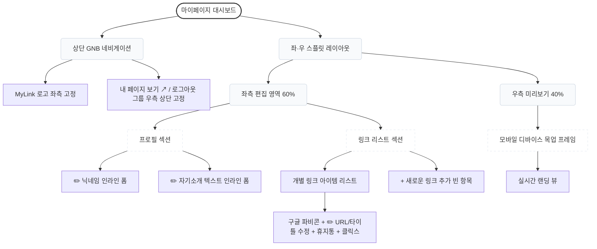

# 마이링크 (MyLink) - 기능적 와이어프레임 (Wireframe)

본 문서는 앱의 레이아웃 구조와 핵심 컴포넌트 배치를 정의합니다. 설정 메뉴를 없애고 텍스트를 즉석에서 조작하는 **'인라인 에디팅(Inline Editing)' 중심 앱**의 특성을 직관적으로 반영했습니다.

---

## 1. 관리자 대시보드 (Admin Dashboard - My Page)

소유자가 로그인 후 진입하여 ✏️ 아이콘이 표시된 텍스트를 즉석에서 고치고 우측 폰 프레임을 통해 실시간으로 확인하는 핵심 편집 공간입니다. 편집 가능한 모든 텍스트 영역에는 항상 ✏️ 아이콘이 고정으로 노출됩니다.

### 1-1. 컴포넌트 구조도 (Mermaid Diagram)


### 1-2. 화면 레이아웃 (ASCII Art)
```text
+-------------------------------------------------------------+
| [로고 MyLink]                  [내 페이지 보기 ↗] [로그아웃] | <- 상단/우측 고정
+-------------------------------------------------------------+
|                                  |                          |
|  [ 편집 영역 (디스플레이 60%) ]  | [ 미리보기 뷰어 (40%) ]  |
|                                  |                          |
|  ▶ 프로필 (마이페이지 편집)      |  +--------------------+  |
|  (항상 ✏️ 아이콘이 표시됨)      |  | [ 모바일 목업 프레임]|  |
|                                  |  |                    |  |
|  [ ✏️ 김크리 ]                  |  |     김크리         |  |
|  [ ✏️ 안녕하세요. 김크리입니다 ] |  |  안녕하세요. 김크리..|  |
|                                  |  |                    |  |
|  ------------------------------  |  |  +--------------+  |  |
|  ▶ 링크 리스트 (마이페이지 편집) |  |  |(파비콘) 링크1 |  |  |
|                                  |  |  +--------------+  |  |
|  +----------------------------+  |  |  +--------------+  |  |
|  | [파비콘] ✏️ 타이틀 적기     |  |  |  |(파비콘) 링크2 |  |  |
|  | ✏️ URL: https://...  [삭제] |  |  |  +--------------+  |  |
|  |            [누적 클릭: 15]   |  |                    |  |
|  +----------------------------+  |  |                    |  |
|                                  |  |      Powered by    |  |
|  +----------------------------+  |  |       MyLink       |  |
|  | [+] 새로운 링크 추가 (클릭)   |  |  +--------------------+  |
|  +----------------------------+  |                          |
+----------------------------------+--------------------------+
```

---

## 2. 방문자용 랜딩 페이지 (User Public Page)

타인에게 프로필 링크(예: `domain.com/슬러그`)를 공유했을 때 방문자가 접속하는 뷰입니다. 이곳은 읽기 전용이므로 연필(✏️) 아이콘이나 편집 요소는 일절 노출되지 않습니다.

### 2-1. 화면 레이아웃 (ASCII Art)
```text
+---------------------------+
|                           |
|       김크리 (닉네임)     | <- H1 (가장 크고 단단한 볼드체 폰트)
|   안녕하세요 김크리입니다 | <- P  (무채색 계열 서브 텍스트)
|                           |
|                           |
|  +---------------------+  |
|  | [파비콘]   링크 1   |  | <- 구글 파비콘과 텍스트 버튼 
|  +---------------------+  |
|                           |
|  +---------------------+  |
|  | [파비콘]   링크 2   |  |
|  +---------------------+  |
|                           |
|                           |
|  [ 공유하기 (Share) ↗ ]   | <- 모바일 OS 기본 공유 모달
|                           |
|      Powered by MyLink    |
+---------------------------+
```
